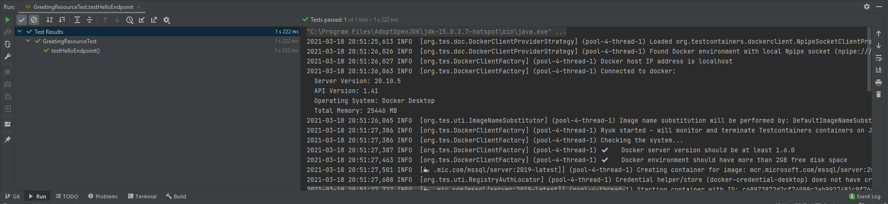

# Quarkus and TestContainers - Drop Your Unit Testing Database

## What is TestContainers ?


TestContainers is a simple library.
It helps with runnning containers for your integration tests.

Basically, instead of relying on installed, long-living applications to run your tests, you can use the library to spawn ephemeral containers that will live only the time of your test.

How great !

It makes your tests portable and loosely coupled with the host they're running on.
The only prerequisite for that is Docker and a JVM testing framework.

In this article, we'll use JUnit 5 aswel as QuarkusTest.

But let's first see how it is better than the traditional alternatives for your tests running against databases.

---

### 👨 Why should I throw away my in-memory database ?

You can't rely on those databases to test your application for a simple reason: they're not of the same kind of the database you're using in production.

### 👨 *What is the problem with that ?*

First of all : different features, different flavors !

You can refer to [this article](https://phauer.com/2017/dont-use-in-memory-databases-tests-h2/) for more information and a more detailed explanation.

Furthermore, [12 factors applications](https://12factor.net/dev-prod-parity) rules state clearly that your development environment should be as close as possible to the production environment.

While this is not always possible for everything, starting with using the same database will already improve this point.


#### Throw that stuff away !

---

### 👨 *Ok, I get it. I'll be using my real development database and make some room for testing tables and run this with my CI server!*

No, don't do that neither !

The simple reasons for this are the following

* The setup is heavy and is required for every new environment: You'll need to setup a database (or a schema if you're using a single database) for your CI-server. And even sometimes multiple ones if you have concurrent test executions (like heavy integration testing).
* Your tests are dependent on an external actor. If the database is unavailable for some reason, your tests can't run.
* The database usually is accessible to anyone who wants to make changes to it.
* You're polluting your database / database server with those unnecessary databases / schemas.
* If you're developping a product, you'll need multiple databases to make sure your application is compatible. I can let you imagine the overhead.


---

## 👨 *Good points ! However, I can fix this easily by running a Docker container instead of connecting to my database server. What do you think?*

It is already way better, however there is some overhead as compared to TestContainers.

* You'll need to have the container constantly running, or launch it during your CI pipeline. Running it during the CI pipeline means there is coupling between your test suite and the CI server you're running on. If you want to change tomorrow, you'll need to port that with you.
* If you're developping a product, you'll need to run multiple of those containers too.
* To run your tests locally, you're also depending on the fact that you'll need to preemptively run your containers before running your integration tests.

Let's just agree on throwing that stuff away too !


---

## Demo: Use Quarkus and TestContainers

You can find the sources for that on the following [Github](https://github.com/YassinHajaj/drop-your-unit-testing-database)

### Generate the Quarkus App !

Let's start by using the [Quarkus starter](https://quarkus.io/get-started/) and choose the following extensions:
* RESTEasy JAX-RS
* Hibernate ORM with Panache
* JDBC Driver - Microsoft SQL Server

Download it, extract it, run it !

`./mvnw compile quarkus:dev`

### Add the TestContainers dependencies !

We'll now add the following dependencies to our project

```
<dependency>
    <groupId>org.testcontainers</groupId>
    <artifactId>testcontainers</artifactId>
    <version>1.15.2</version>
    <scope>test</scope>
</dependency>
<dependency>
    <groupId>org.testcontainers</groupId>
    <artifactId>junit-jupiter</artifactId>
    <version>1.15.2</version>
    <scope>test</scope>
</dependency>
<dependency>
    <groupId>org.testcontainers</groupId>
    <artifactId>mssqlserver</artifactId>
    <version>1.15.2</version>
    <scope>test</scope>
</dependency>
```

### Modify the Application !

We'll just modify our resource to make it insert an entity in database.
For this, we'll not make it too complicated so we'll just modify the `GreetingResource`

```
@Path("/hello")
public class GreetingResource {

    @GET
    @Transactional // #1
    @Produces(MediaType.TEXT_PLAIN)
    public String hello() {
        GreetingEntity greetingEntity = new GreetingEntity();
        greetingEntity.setMessage("hello !");
        greetingEntity.persistAndFlush(); // #2
        return greetingEntity.getMessage();
    }

    @Entity
    public static class GreetingEntity extends PanacheEntity { // #3

        private String message;

        public String getMessage() {
            return message;
        }

        public void setMessage(String message) {
            this.message = message;
        }
    }
}
```

Let's consider the rest of the resource as trivial, but we'll still look at 3 specific points:

1. We need to make our resource `@Transactional` to make sure we can perform the change to our database
2. Panache is an entity-centric library working on top of Hibernate ORM. As you can see, no need for a `@PersistenceContext` or any other JPA resource. The entity manages itself.
3. To make use of Panache, we extend `PanacheEntity`. It provides us with an id aswel as the utilities of Panache.

### Create a Quarkus Test resource for our container

With other frameworks, we would not have to do that, but unfortunately `@QuarkusTest` conflicts with `@Testcontainer`.

However, we have a solution, we just need to make sure our container runs before our `@QuarkusTest` runs.

We can manage this easily by using `QuarkusTestResourceLifecycleManager`

```
public class MSSQLServerResource implements QuarkusTestResourceLifecycleManager {

    @Container
    @SuppressWarnings("rawtypes")
    private final MSSQLServerContainer mssqlserver = new MSSQLServerContainer("mcr.microsoft.com/mssql/server:2019-latest")
            .acceptLicense();

    @Override
    public Map<String, String> start() {
        mssqlserver.start();
        while (!mssqlserver.isRunning()) {
            System.out.println(LocalDate.now() + " : Not running yet !");
        }
        Map<String, String> properties = new HashMap<>();
        properties.put("quarkus.datasource.db-kind", "mssql");
        properties.put("quarkus.datasource.username", mssqlserver.getUsername());
        properties.put("quarkus.datasource.password", mssqlserver.getPassword());
        properties.put("quarkus.datasource.jdbc.url", mssqlserver.getJdbcUrl());
        properties.put("quarkus.hibernate-orm.database.generation", "create");

        return properties;
    }

    @Override
    public void stop() {
        mssqlserver.stop();
    }
}
```

We used the following to attach our container to our resource

```
@Container
@SuppressWarnings("rawtypes")
private final MSSQLServerContainer mssqlserver = new MSSQLServerContainer("mcr.microsoft.com/mssql/server:2019-latest")
        .acceptLicense();
```

Since we're using a `QuarkusTestResourceLifecycleManager`, we'll need to `@Override` start and stop.

Inside of these methods, we can use `MSSQLServerContainer#start` and `MSSQLServerContainer#stop` which makes it convenient.

We'll also write a loop to make sure the container is running before invoking any method on it.

Now that this is all done, we'll need to inject properties for our Quarkus container to use during our integration test. These properties are the connection url, the username, the password. But also the database generation strategy and the type of database (to link it with the driver).

### Modify the Tests !

We'll make sure our tests call the resource.
This will result in an insertion of course, and we'll assert on that too in our test.

```
@QuarkusTest
@QuarkusTestResource(MSSQLServerResource.class)
public class GreetingResourceTest {

    @Test
    public void testHelloEndpoint() {
        Assertions.assertEquals(0, GreetingEntity.count());

        given()
                .when().get("/hello")
                .then()
                .statusCode(200)
                .body(is("hello !"));

        Assertions.assertEquals(1, GreetingEntity.count());
    }

}
```

### Success !



You can find the sources for that on the following [Github](https://github.com/YassinHajaj/drop-your-unit-testing-database)